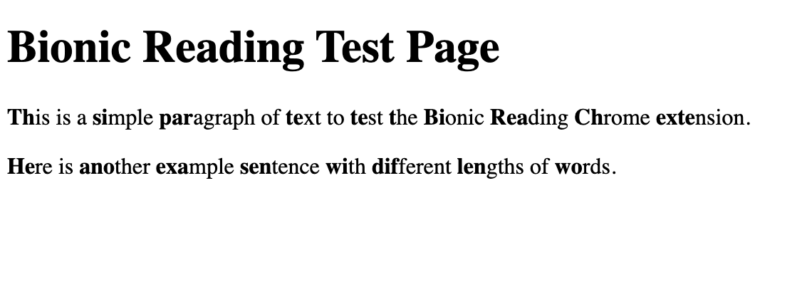

This extension enables bionic reading on text blocks on most websites. 
Bionic reading is a method that allows your brain to autocomplete words faster when reading by bolding the first few letters of each word. This extension finds the paragraph blocks in a webpage and bolds the first few letters of words that are more than two characters long.

Example of how bionic reading looks on an example webpage:

Example of bionic reading in action (Larry David's Wikipedia page):\n

